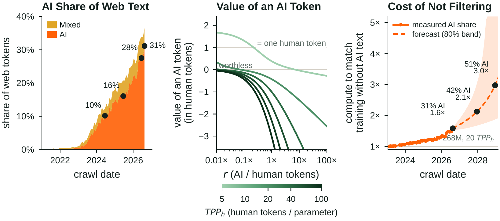

# WildAI

[](https://arxiv.org/abs/2609.40295)
[](https://huggingface.co/pangram/WildAI-models)
[](https://huggingface.co/datasets/pangram/WildAI)
[](https://creativecommons.org/licenses/by-nc-sa/4.0/)

Code for [*How Much Is an AI Token Worth? Scaling Laws for Wild AI-Generated Web Text*](https://arxiv.org/abs/2609.40295).

> **License: [CC BY-NC-SA 4.0](https://creativecommons.org/licenses/by-nc-sa/4.0/).** This code, the WildAI models and the
> WildAI dataset are all released under the Creative Commons Attribution-NonCommercial-ShareAlike 4.0 International
> license: you may use and adapt them for non-commercial purposes, with attribution, and must share adaptations under the
> same license. See [`LICENSE`](LICENSE).

Wild AI text is AI-generated text that arrives unlabeled in web crawls. This repository builds a corpus of it, trains
the paper's 800-model grid on controlled mixtures of human and AI web text, evaluates the models, fits the scaling
laws, and draws every figure and table of the paper.



*Figure 1. Left: share of web tokens in documents Pangram labels AI or Mixed, by crawl month. Middle: the value of one
added AI token at 268M parameters, in human tokens, across human-token budgets. Right: the compute an unfiltered crawl
needs to match training on its human subset (268M, 20 human tokens per parameter), at the measured and forecast AI
shares. Drawn by `python -m paper.make --palette pangram --only law_overview`.*

| | |
|---|---|
| Data | [`pangram/WildAI`](https://huggingface.co/datasets/pangram/WildAI) on Hugging Face: 96M English web documents labeled human-written, AI-generated or mixed, with URL, date, topic and format |
| Models | [`pangram/WildAI-models`](https://huggingface.co/pangram/WildAI-models) on Hugging Face: every model of the paper, one subfolder per model |
| Results | [`results/`](results/): every model's token counts and losses, the fitted laws, the web measurements |

## Install

```bash
uv venv --python 3.12 && uv pip install -e ".[paper]"          # figures and tables only (CPU)
uv pip install -e ".[train]"                                    # training and evaluation (CUDA 12.8)
uv pip install -e ".[data,label]"                               # data pipeline and labeling
```

## Reproduce the paper

Every step reads and writes the files in `results/`, so each can be run on its own.

```bash
python -m paper.make                     # every figure and table, from results/ (about a minute on a CPU)
python -m wildai.laws.run --workers 64   # refit all laws and derived numbers into results/laws/ (about 40 CPU-minutes)
```

To go further back, rescore a released model or retrain one (`results/models.csv` lists them by name). The models,
the tokenizer and the training pools come from Hugging Face unless you pass local paths (`--checkpoint`, `--tokenizer`,
`--input`):

```bash
python -m wildai.data.evalsets.cli c4 cosmopedia fw22 --output-dir data/eval    # evaluation sets, from their public sources
python -m wildai.evaluation.bpb --model 268m-g072-ai-r0.5 --eval-dir data/eval --targets c4 cosmopedia fw22
python -m wildai.training.pools --pool human --output data/human                # tokenize the released pools
python -m wildai.training.pools --pool ai --output data/ai
torchrun --standalone --nproc_per_node=8 -m wildai.training.train --model 268m-g072-ai-r0.5 --data-dir data --out-dir checkpoints
python -m wildai.evaluation.bpb --checkpoint checkpoints/268m-g072-ai-r0.5 --eval-dir data/eval --targets c4 cosmopedia fw22
```

The data pipeline (collection, EditLens preselection, Pangram labeling through the public API, pools, evaluation sets,
web measurements) is described in [`src/wildai/data`](src/wildai/data/__init__.py); labeling with Pangram needs an API
key in `PANGRAM_API_KEY`.

## Layout

| Path | What it does |
|---|---|
| `src/wildai/data` | collect FineWeb and Common Crawl documents, build pools and evaluation sets, measure the web, export the dataset |
| `src/wildai/labeling` | EditLens, Pangram (public API) and WebOrganizer labelers |
| `src/wildai/training` | the model and training recipe (adapted from [nanochat](https://github.com/karpathy/nanochat)), data mixtures, training CLI |
| `src/wildai/evaluation` | bits per byte, Paloma, CORE and MMLU, generation and AI-typical phrases |
| `src/wildai/laws` | our law and eleven published laws: fitting, held-out scoring, compute-equivalent gain, ablations |
| `src/wildai/hub` | export checkpoints to Hugging Face `transformers` |
| `paper/` | the paper's figures and tables |
| `results/` | the numbers behind them |
| `configs/` | data, training and evaluation settings |

## Model names

`<size>-<group>-<arm>[-r<ratio>]`, e.g. `268m-g072-ai-r0.5`: group `g072` is one human-only control
(`268m-g072-control`) and every run trained on exactly its human documents plus added AI text (`ai`) or fresh human text
(`human`), with $r$ added tokens per human token. `f01`–`f19` are filtering pairs (`-web-mix`, `-ai-removed`) and
`-repeat-r<r>` models repeat their control's human text.

## License

Everything released with the paper is licensed under [CC BY-NC-SA 4.0](https://creativecommons.org/licenses/by-nc-sa/4.0/)
(full text in [`LICENSE`](LICENSE)):

- this repository's code, configs and results;
- the WildAI models on Hugging Face (`pangram/WildAI-models`);
- the WildAI dataset on Hugging Face (`pangram/WildAI`), whose text also remains subject to FineWeb's ODC-By 1.0 license
  and Common Crawl's terms of use.

The model and training code adapted from [nanochat](https://github.com/karpathy/nanochat) also keeps nanochat's MIT
notice, in [`src/wildai/training/NOTICE`](src/wildai/training/NOTICE).

## Development

This code was written with the help of coding agents (Claude Code and Codex).

## Citation

```bibtex
@article{russell2026wildai,
  title   = {How Much Is an AI Token Worth? Scaling Laws for Wild AI-Generated Web Text},
  author  = {Russell, Jenna and Glickenhaus, Ben and Thai, Katherine and Wieting, John and Iyyer, Mohit and Spero, Max and Emi, Bradley},
  journal = {arXiv preprint arXiv:2609.40295},
  year    = {2026},
  url     = {https://arxiv.org/abs/2609.40295}
}
```
